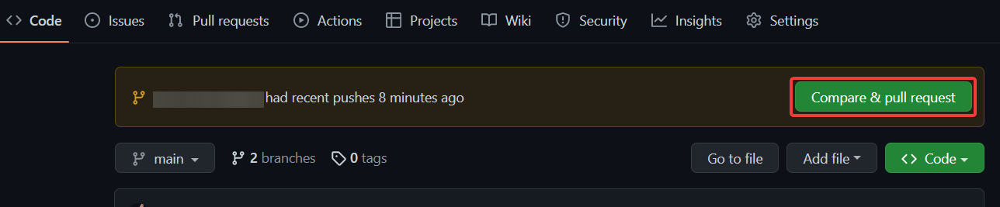

## Завдання
1) Склонувати собі цей репозиторій, добавити в нього вірш на власний вибір та створити pull request, щоб залити свій шматок змін в мастер (також може бути будь-яка інша гілка).

2) Перетворити(або переписати, якщо ви використовували *`.doc`*) свій вірш в *`.html`* файл. За бажанням добавте **inline** або **internal css**, щоб зробити його приємнішим для прочитання.      
Для прикладу можна подивитись [тут](/html/трактор.html). Так сторінка виглядає без css:

А так з мінімальним css:


## Пояснення GitHub Pull Requests
Для тих хто не зрозумів про що йдеться, бо ще не мав досвіду:

### Нетехнічний вступ
Якщо не говорити про програмування, а впринципі. В житті завжди є перевірка чиєїсь роботи іншими людьми, або іншими словами - рев‘ю.
Наприклад: завжди якусь статтю в журналістиці перед тим як опублікувати десь її віддають на рев‘ю редакторам.

### Програмування
Так само в програмуванні є рев'ю. Воно називається код рев'ю - code review.
Це процедура коли інші девелопери з команди можуть прокоментувати, запропонувати щось.

Для цього GitHub має певний функціонал - Pull Requests.

Щоб залити вірш через Pull Request треба додати свій вірш локально на окрему гілку, пушнути її, і тоді створити на її базі Pull Request.


## Як це зробити на практиці 

1. `git clone https://github.com/TechnicalWeeks2023/playground-project.git` 
2. `git checkout -b branch_name`, де "branch_name" назва вашої нової гілки
   1. Завжди, намагайтесь придумати змістовні назви власним гілкам, комітам, змінним, і т.п. Це допомагає краще комунікувати власні дії в команді та позитивно демонструє ваш рівень.
3. Добавляєте файл з вашим віршем у відповідну папку
4. Командою `cd .\txt\` або `cd .\html\` заходите в папку з `txt` або `html` файлами відповідно(в залежності від того, файл з яким розширенням ви закинули) 
5. `git add .`
6. `git commit -m "назва коміта"` commit варто називати змістовно, напр. ім'я вірша("commit" - це повідомлення, тому може складатися з декількох слів з <kbd>Space</kbd> між ними)
Наприклад:
```
git commit -m "Deleted button in the main menu"
```
7. `git push origin -u branch_name`, в нашому випадку - назва вашої гілки, яку ви створити при checkout -b(назва гілки це одне слово-назва, для читабельності якого можуть використовувати `_`, `-`, `/` символи)
Наприклад:
```
git checkout -b f#84_fix_registration_button_alignment
```
або
```
git checkout -b primer/issues/1021/react-select-panel
```
8. Тоді кнопочками можна створити Pull Request (див. скріншот 1 та 2)
9. Киньте лінк на pull request в телеграм канал, щоб нагадати людям його перевірити)
10. Щоб залити зміни в мастер - нажати кнопку - Merge в цьому Pull Request-і
11. Вірш так само появиться на мастері, але просто через процедуру рев’ю, а не напряму в мастер без code review :)
12. Вітаємо, ви перейшли на новий рівень :)

Не забудьте зробити `Merge` після підтвердження вашого `pull request`. 



